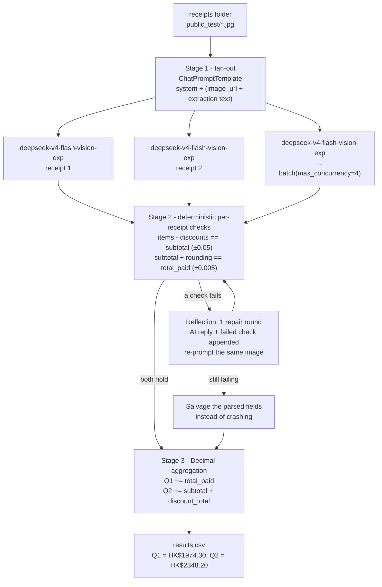

# FTEC5660 Homework 1: Receipt Chain

Build a LangChain pipeline that reads every supermarket receipt in a folder
with the vision-capable DeepSeek Flash model and answers these two questions:

1. How much money did I spend in total for these bills?
2. How much would I have had to pay without the discount?

For this homework, **amount spent** means the final payment after the receipt's
rounding line. **Without the discount** means the sum of the original positive
item prices: add back every promotion, coupon, member, app, packaging-damage,
and percentage discount, but do not add back rounding.

## Student task

Only edit the two functions in `hw1.py` that contain `### YOUR CODE HERE`:

- `build_chain()` creates your LangChain chain.
- `answer_queries()` runs the chain on the receipt images and returns one final
  response for each question.

You may use prompt chaining, routing, parallel calls, reflection, or a
combination. Your final responses should each contain one HKD amount. Do not
hard-code filenames or public answers; grading uses unseen receipt folders.

## Setup and public test

```bash
python3 -m venv .venv
source .venv/bin/activate
pip install -r requirements.txt
```

Put your DeepSeek key after `DEEPSEEK_API_KEY=` in `.env`, then run:

```bash
python3 hw1.py --image-folder public_test
```

The program creates `results.csv` in the current directory. Its columns are
`query`, `model_response`, and `correctness`. The public answers are in
`public_test/ground_truth.json`. The starter intentionally returns the dummy
response `please design your chain to answer these two queries.` so it runs
before you add any API code.

The required model is `deepseek-v4-flash-vision-exp`, the vision-capable
DeepSeek Flash model. JPEG, PNG, GIF, and WebP inputs are accepted by the
homework runner.


## Homework 1 solution:

### Chain design

The chain separates **reading** (what a vision model is good at) from **arithmetic**
(what it is not). Each receipt is transcribed once into a strict JSON record, every
record is checked against two receipt-level identities, records that fail are sent
back to the model once with the failed identity quoted back to it, and the final
folders totals are computed in Python with `Decimal` — the model never performs the
summation.



```
    public_test/*.jpg
            |
            v
  [ per-receipt vision extraction ]        parallel, one call per image
   system: receipt-reading engine
   human : image_url + extraction rules
            |
            v
  { item_lines, discount_lines, subtotal, rounding, total_paid }
            |
            v
  [ consistency gate ] ---- fail ----> [ repair round: failed check quoted back ]
            |                                        |
            | pass                                   v
            |<-------------------------------- same gate
            v
  [ Decimal aggregation in Python ]  ->  {"HK$1974.30", "HK$2348.20"}
            |
            v
        results.csv
```

### Solution description

I built an extraction-then-aggregation chain rather than asking the model for the
folder totals directly, because the hard part of this task is reading receipt lines
correctly, not adding seven numbers. `build_chain()` creates one
`deepseek-v4-flash-vision-exp` chat model and one `ChatPromptTemplate` whose human
turn carries the receipt image (`data:` URL built by `image_data_url`) followed by a
tight extraction spec: the positive `item_lines` above the 小計/SUBTOTAL line, the
negative `discount_lines` above it (包裝變形 packaging-damage, `Buy N Save`, `% OFF`
coupons, member discounts), the `subtotal`, the `rounding`, and the payment line that
actually follows ROUNDING (OCTOPUS / 八達通 / 現金 / 扣除金額) — explicitly excluding
餘額 and 找續, which are the two lines that most easily masquerade as the total.
`answer_queries()` fans that prompt out over every receipt with LangChain's
`batch(..., max_concurrency=4)`, then enforces two receipt-level identities:
`sum(item_lines) - sum(|discount_lines|) == subtotal` and
`subtotal + rounding == total_paid`. Any receipt that violates an identity gets one
reflection round — the model's own reply plus the failed identity are appended as an
`AIMessage`/`HumanMessage` pair and the image is re-read — and a receipt that still
fails falls back to whichever fields did parse, so a single bad image degrades the
answer instead of crashing the run. Only then are the two folder totals folded with
`Decimal` arithmetic (Query 1 = Σ `total_paid`; Query 2 = Σ `subtotal +
discount_total`, i.e. rounding deliberately not added back), and each answer is
formatted as a single `HK$` amount so the runner's one-number check always sees
exactly one numeric token. On the public folder this returns
`HK$1974.30` and `HK$2348.20`, matching `ground_truth.json` for both questions;
the same chain was additionally re-run on random 3-, 4-, 5- and 7-receipt subsets of
`public_test` to confirm the aggregation does not depend on the folder size.

